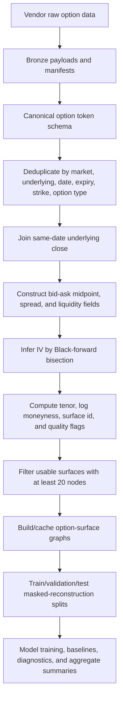

# Paper Plan

## Working Title

**LoG-IV: Leakage-Controlled Graph Learning for Irregular Option-Implied
Volatility Surfaces**

## Manuscript Thesis

LoG-IV should be written as a graph-learning benchmark and modeling paper. The
central empirical object is an option chain represented as an irregular graph of
option contracts. The central question is whether graph and token models can
reconstruct masked implied volatilities under leakage-controlled missingness
more accurately than train-only, within-surface interpolation, and surface
fitting baselines, especially when quote reliability varies with liquidity.

This is not a trading, alpha, hedging, execution, or live risk-management paper.
The first manuscript should not contain a trading backtest. Japan is an
out-of-distribution evaluation setting, not evidence for a cross-market causal
claim.

This document is organized as the intended manuscript skeleton. It separates
the paper-facing argument from the live evidence ledger in
`docs/results_snapshot.md`, the live Results and Discussion chapter that is
completed as benchmark artifacts are accepted.

## 1. Introduction

### 1.1 Overview And Motivation

Option-implied-volatility surfaces are usually described as smooth functions of
strike and tenor, but real option chains are sparse, irregular, and unevenly
quoted. Strike grids differ by expiry, listed maturities are not uniformly
spaced, and observed quote quality changes with bid-ask spread, volume, open
interest, and contract moneyness. Standard fixed-grid surface models often hide
these features by interpolating or resampling the chain before learning.

LoG-IV studies the option chain in its native sparse layout. Each option
contract is treated as a token or graph node with strike, tenor, option type,
quote fields, and liquidity fields. Edges represent local strike-tenor
structure and, where used, liquidity similarity. The paper asks whether this
irregular representation improves masked IV reconstruction without leaking
masked quote information into the query nodes.

The work matters because realistic option-surface learning has three practical
constraints that are easy to miss in clean grid tasks:

- option-token geometry is irregular in strike and tenor;
- quote missingness is structured rather than purely random;
- observed quotes are noisy, and liquidity variables are plausible indicators
  of quote precision.

### 1.2 Literature Positioning And Existing Results

Neural IV smoothing, operator models, graph attention models, and neural-process
models already show that flexible function approximators can fit or complete IV
surfaces. The gap for this paper is not "neural networks for IV surfaces" in
general. Section 2 gives the detailed literature review; the introduction
should summarize the relevant prior families and then state what LoG-IV adds.

The current internal evidence suggests that graph variants can substantially
beat train-only and within-surface interpolation baselines under stratified
masking. However, the current evidence is not final manuscript evidence because
harder-mask confirmation, full SVI accounting, OOD evaluation, reliability
analysis, and final figures are still pending. The Results and Discussion
document must mark each result as complete, incomplete, candidate-selection, or
pending.

### 1.3 Research Gap

The manuscript gap is an auditable benchmark for irregular option graphs with:

- strict masked-node leakage controls;
- market-relevant missingness regimes;
- explicit train-only and within-surface baselines;
- liquidity-aware model ablations;
- reconstruction metrics reported together with price and no-arbitrage
  diagnostics.

### 1.4 Core Research Question

Can graph models reconstruct sparse and irregular option-implied-volatility
surfaces under leakage-controlled masking and liquidity-dependent observation
noise more accurately than train-only and within-surface interpolation or
surface-fitting baselines?

The question decomposes into three testable sub-questions:

- **Representation:** does graph or token structure help beyond fixed-grid,
  no-edge, and set/context baselines?
- **Reliability:** do liquidity variables help as signals of quote reliability,
  beyond ordinary feature augmentation?
- **Protocol robustness:** do gains survive realistic missingness, strict
  leakage controls, and out-of-distribution evaluation?

### 1.5 Contributions

The contribution claim should stay narrow and auditable:

1. A leakage-controlled masked-reconstruction benchmark for irregular
   option-surface graphs.
2. A graph construction and masking contract that prevents masked query nodes
   from carrying same-day quote-derived target information.
3. A model and ablation ladder for liquidity-aware graph learning, including
   liquidity-feature-only, scalar-gate, heteroscedastic-loss, reliability-gated,
   random-edge, shuffled-edge, set-context, and decoded-regularized variants.
4. Evaluation under market-relevant missingness regimes: `stratified`,
   `liquidity_correlated`, and `block_wing`.
5. Diagnostics that report reconstruction error together with normalized
   decoded-price error, reliability diagnostics, and sampled no-arbitrage
   violation counts.

### 1.6 Claim Boundary

Do not claim novelty for any of the following by themselves:

- using neural models for implied-volatility surfaces;
- turning option chains into graphs;
- adding no-arbitrage penalties;
- using liquidity variables as extra node features.

The defensible novelty, if the evidence gate passes, is the combination of
leakage-controlled masking, irregular graph evaluation, liquidity-reliability
ablation, and missingness-aware diagnostics.

## 2. Detailed Literature Review

### 2.1 Neural Implied-Volatility Smoothing

[Ackerer, Tagasovska, and Vatter, **Deep Smoothing of the Implied Volatility
Surface**, NeurIPS 2020](https://proceedings.neurips.cc/paper/2020/hash/858e47701162578e5e627cd93ab0938a-Abstract.html)
is the core neural-smoothing anchor. It establishes that neural models can fit
and smooth implied-volatility surfaces with financial constraints. LoG-IV should
not present neural IV smoothing as new.

[Yang et al., **HyperIV: Real-time Implied Volatility Smoothing**, ICML
2025](https://icml.cc/virtual/2025/poster/44077) is a strong real-time and
hard-constraint anchor. LoG-IV is not primarily a latency paper and should not
claim hard no-arbitrage guarantees unless the corresponding assumptions and
checks are implemented.

### 2.2 Graph And Operator Models For Irregular Option Data

[Wiedemann, Jacquier, and Gonon, **Operator Deep Smoothing for Implied
Volatility**, ICLR
2025](https://proceedings.iclr.cc/paper_files/paper/2025/hash/f115f619b62833aadc5acb058975b0e6-Abstract-Conference.html)
is the closest graph/operator anchor. It maps irregular observed option data to
smoothed surfaces. LoG-IV should differentiate through leakage control,
missingness regimes, and liquidity-reliability modeling rather than through the
existence of an irregular operator model.

[Liang et al., **Hexagon-Net: Heterogeneous Cross-View Aligned Graph Attention
Networks for Implied Volatility Surface Prediction**, KDD
2025](https://eprints.lse.ac.uk/128236/) is the closest heterogeneous graph
attention anchor. It motivates uneven information across IV surface regions
because of liquidity constraints. LoG-IV should treat this as prior art for
graph attention and focus its own claim on benchmark protocol and reliability
ablation.

### 2.3 Sparse-Quote Completion And Neural Processes

[Zhuang and Wu, **Meta-Learning Neural Process for Implied Volatility Surfaces
with SABR-induced Priors**, arXiv 2025](https://arxiv.org/abs/2509.11928)
anchors the sparse-quote neural-process family. LoG-IV should include CNP/ANP
style baselines or proxies where possible, but should describe them as sparse
completion comparators rather than graph methods.

### 2.4 Classical Surface Fitting And No-Arbitrage References

[Gatheral and Jacquier, **Arbitrage-free SVI volatility surfaces**,
Quantitative Finance 2014](https://www.tandfonline.com/doi/abs/10.1080/14697688.2013.819986)
is the classical no-arbitrage SVI anchor. SVI/SSVI accounting remains necessary
for manuscript-level comparison. Raw SVI failure rates, timeouts,
underidentified slices, and constrained/projection variants should be reported
explicitly rather than hidden behind fallback behavior.

### 2.5 Research Gap And Positioning

LoG-IV should be positioned as a benchmark and evaluation contribution:

- prior work establishes neural, graph, and operator approaches for IV
  smoothing;
- LoG-IV asks whether those families remain strong under leakage-controlled
  masked reconstruction and market-relevant missingness;
- liquidity is evaluated as noisy evidence about quote precision, not asserted
  as a causal mechanism.

## 3. Materials And Methods

### 3.1 Market And Data Description

The main empirical material is the expanded U.S. option silver table:

```text
data/silver/option_quotes/us_option_quotes_expanded.parquet
```

Current U.S. `data_v1` status from the live manifest:

- 2,979,716 deduplicated option rows;
- 40 underlyings;
- 62 observation dates and 62 usable observation dates;
- 2,867,637 IV-usable rows;
- 2,480 usable `(underlying, observation_date)` surfaces after
  `min_nodes_per_surface=20`;
- window: 2026-02-02 through 2026-04-30;
- IV source: option mid price with same-date underlying daily close;
- IV method: Black-forward bisection with zero rate and zero dividend.

The out-of-distribution material is the expanded Japan option silver table:

```text
data/silver/option_quotes/jp_option_quotes_expanded.parquet
```

Current Japan `data_v0` status from the live manifest:

- 557,982 deduplicated rows;
- 249 underlyings;
- 32 observation dates and 32 usable observation dates;
- 557,982 IV-usable rows;
- 7,488 usable `(underlying, observation_date)` surfaces after the same
  minimum-node gate;
- window: 2026-03-16 through 2026-04-30.

Synthetic-LoG-IV is a reproducibility and controlled-diagnostic material. It
should be used for oracle diagnostics and no-arbitrage sanity checks, not as a
substitute for real U.S. benchmark evidence.

### 3.2 Preprocessing And Pretreatment Pipeline

The canonical option token is:

```text
(market, underlying, observation_date, expiry, strike, option_type)
```

The manuscript methods section should describe the preprocessing flow as a
reproducible pipeline:



Preprocessing steps to report:

1. Ingest vendor option rows into bronze payloads with manifests.
2. Normalize rows into the canonical silver token schema.
3. Deduplicate by canonical token key.
4. Join same-date underlying daily close as the current spot/forward proxy.
5. Construct mid prices and relative spreads where bid/ask are available.
6. Infer IV by Black-forward bisection when vendor IV is unavailable.
7. Compute tenor, log moneyness, quote-liquidity fields, and surface IDs.
8. Filter to usable surfaces with at least `min_nodes_per_surface=20`.
9. Cache graph objects under `data/gold/graph_cache`.

The current IV inversion uses a zero-rate, zero-dividend proxy. This is
acceptable for the present benchmark target but is not sufficient for strict
pricing or no-arbitrage claims. The manuscript must state this limitation.

### 3.3 Pretreatment Outputs, Feature Engineering, And Leakage Controls

Each node represents one option token. Candidate model features are grouped as:

- **geometry:** log moneyness, tenor, strike/expiry-derived coordinates;
- **contract metadata:** option type and market/underlying/date identifiers
  used for grouping or embedding where allowed;
- **visible quote features:** IV, bid, ask, mid, spread, volume, open interest,
  and liquidity score on visible context nodes;
- **target fields:** IV and decoded normalized price, available only to loss,
  metrics, and diagnostics for masked nodes.

Masked query nodes must not carry same-day quote-derived fields:

- IV;
- bid, ask, mid, spread;
- volume, open interest;
- quote-derived liquidity score;
- decoded price;
- IV-derived Greeks.

This masking rule is the main leakage-control contract. It should be reported as
a benchmark condition, not an implementation detail.

The pretreatment outputs used by the benchmark are:

- standardized option-token identities;
- same-date underlying close joined to each option row;
- midpoint, spread, and liquidity proxies;
- inferred IV when available under the current zero-rate, zero-dividend
  assumption;
- tenor, log moneyness, surface ID, and quality flags;
- graph-cache keys for reproducible surface construction.

### 3.4 Method: Graph Construction

Each usable `(underlying, observation_date)` surface becomes one graph. Nodes
are option contracts. Edge families include:

- strike-neighbor edges within nearby expiry/maturity slices;
- maturity-neighbor edges for nearby tenor relationships;
- liquidity-similarity edges where enabled;
- ablation edges such as random or shuffled edges for topology controls.

The key comparison is whether native sparse graph structure helps more than
no-edge token, set/context, interpolation, or surface-fitting baselines.

### 3.5 Task, Splits, And Missingness

The main task is masked reconstruction:

1. Split surfaces into train/validation/test by a fixed split protocol.
2. Mask a subset of option tokens in each validation/test surface.
3. Remove quote-derived fields from masked query nodes.
4. Preserve target fields only for loss, metrics, and diagnostics.
5. Report headline metrics only on masked nodes.

The split modes supported by the implementation are:

- `temporal`;
- `ticker_holdout`;
- `temporal_ticker_holdout`;
- `random` for engineering checks only.

The masking regimes are:

- `stratified`: bucket-aware masking across moneyness, tenor, and option type;
- `random`: engineering sanity check;
- `liquidity_correlated`: harder missingness biased toward less reliable or
  less liquid regions;
- `block_wing`: structured wing/block masking.

### 3.6 Method: Models And Baselines

Model families to report as LoG-IV candidates or ablations:

- `encoder_mlp`: no-graph token encoder baseline;
- `set_context_mlp`: no-edge set/context baseline;
- `gnn_no_liq`: graph model without liquidity features;
- `gnn_liq`: graph model with liquidity features;
- `gnn_decoded_calendar_convexity`: graph model with decoded price,
  calendar/convexity regularization, and diagnostics;
- `lagos_liq_feature_only`: liquidity features without the reliability gate;
- `lagos_scalar_gate`: scalar liquidity gate;
- `lagos_loss_only`: heteroscedastic loss emphasis;
- `lagos_attn_only`: attention/reliability-gate emphasis;
- `lagos_hetero_full`: combined heteroscedastic and reliability components;
- `lagos_random_edges` and `lagos_shuffled_edges`: graph-topology controls.

Train-only baselines:

- global mean IV;
- underlying mean IV;
- moneyness-tenor bucket mean IV;
- train-only moneyness-tenor kNN.

Within-surface baselines using only visible evaluation nodes after masking:

- visible-node kNN;
- local linear interpolation/regression;
- RBF interpolation;
- raw SVI per expiry;
- constrained/projected SVI and SSVI under `baseline_preset=full`.

Related-work proxy baselines:

- Deep Smoothing / fixed-grid CNN proxy;
- ODS-style continuous-coordinate operator proxy;
- Hexagon-style heterogeneous attention proxy;
- HyperIV proxy or adapter path;
- CNP/ANP-style sparse quote completion baselines.

### 3.7 Loss Functions And Training

Training optimizes masked IV reconstruction with optional auxiliary losses:

- IV reconstruction loss on masked targets;
- decoded normalized-price loss;
- geometry and liquidity reconstruction where configured;
- smoothness or decoded no-arbitrage regularizers;
- heteroscedastic weighting and reliability-gating terms for LAGOS variants.

The manuscript should separate model-selection criteria from final evidence.
Short two-epoch screens are candidate-selection evidence only. Manuscript-level
claims require completed benchmark families with fixed splits, recorded
baselines, diagnostics, and aggregate summaries.

### 3.8 Performance Metrics And Selection Criteria

Headline metrics:

- masked IV MAE;
- masked IV RMSE;
- masked p90 absolute error;
- normalized decoded-price MAE/RMSE;
- delta versus train-only moneyness-tenor kNN;
- delta versus the strongest relevant within-surface baseline.

Supporting diagnostics:

- calendar-spread violation counts;
- convexity/butterfly violation counts;
- vertical-spread and put-call diagnostics where available;
- reliability calibration and predicted-precision diagnostics;
- bucketed errors by liquidity, moneyness, tenor, underlying, option type, and
  split;
- OOD degradation ratios for Japan or ticker holdout;
- SVI failure, timeout, underidentified, and constraint/projection rates.

Selection criteria:

1. A model must beat train-only baselines on masked-node IV metrics.
2. A manuscript-level model should beat the relevant within-surface baseline,
   not only train-only baselines.
3. Diagnostics must not undermine scalar reconstruction gains.
4. Liquidity-aware claims require ablations showing that liquidity improves
   robustness or reliability beyond ordinary feature addition.
5. OOD claims require normalized degradation against simple baselines.

### 3.9 Artifacts And Reproducibility

Each benchmark run should write:

- `manifest.json`;
- `splits.json`;
- `metrics_epoch.jsonl`;
- `metrics_summary.json`;
- `predictions.parquet`;
- `baselines_summary.csv`;
- `diagnostic_leakage_prone_baselines.csv`;
- `diagnostics_price.json`;
- `diagnostics_reliability.json`;
- `diagnostics_no_arbitrage.json`;
- `postprocess_summary.json`;
- aggregate `benchmark_summary.csv` when the matrix completes.

Run directories should use compact aliases such as `a1-e20-lc` and
`b-us-gdcc-mr-t-e20-s1`. Full protocol metadata belongs in manifests and CSV
summaries rather than long folder names.

## 4. Expected Experiments

### 4.1 Evidence Gates

| Gate | Purpose | Minimum evidence |
| --- | --- | --- |
| Data gate | Benchmark may run | U.S. has at least 2,400 usable surfaces; Japan has at least 20 usable dates for OOD checks. |
| Protocol gate | Results are interpretable | Fixed splits, masked-node leakage controls, train-only baselines, within-surface baselines, and artifacts are recorded. |
| Benchmark gate | Manuscript-level evidence | Multi-seed runs beat relevant baselines on masked-node metrics without materially worse diagnostics. |
| Discussion gate | Claims are defensible | Error, price, no-arbitrage, reliability, bucket, and OOD diagnostics are interpreted together. |

### 4.2 Main Experiment Matrix

| Experiment | Purpose | Current status | Required outcome |
| --- | --- | --- | --- |
| A1 stratified, 20 epochs, 3 seeds | Establish first multi-seed U.S. masked-reconstruction benchmark | Recorded in docs, local artifact missing | Restore or rerun `reports/runs/a1-str/`. |
| Harder missingness top4 screen | Select candidates under `liquidity_correlated` and `block_wing` | Complete two-epoch screen | Treat as candidate-selection only. |
| Top2 hard-mask confirmation | Longer confirmation for `lagos_liq_feature_only` and `gnn_decoded_calendar_convexity` | Incomplete `a1-e20-lc`; `block_wing` pending | Complete both masks and aggregate summaries. |
| Full SVI accounting | Classical calibration baseline and failure-rate accounting | Pending | Report raw/constrained/projected outcomes and failures directly. |
| Graph necessity | Test no-edge, random-edge, shuffled-edge, and graph variants | Partly screened | Confirm at candidate budget. |
| Liquidity reliability | Test liquidity-feature and reliability-gated variants | Partly screened | Show whether liquidity helps beyond ordinary features. |
| OOD robustness | Japan or ticker-holdout degradation | Pending | Normalize against simple train-only and within-surface baselines. |
| Bucket/worst-bucket analysis | Identify where gains hold or fail | Pending | Report liquidity, moneyness, tenor, underlying, and option-type buckets. |

### 4.3 Planned Tables And Figures

Expected tables:

1. Dataset summary and acceptance gates.
2. Model and baseline taxonomy.
3. Main masked-IV benchmark under `stratified`, `liquidity_correlated`, and
   `block_wing`.
4. Price and no-arbitrage diagnostics.
5. Reliability and bucketed errors.
6. OOD degradation and ticker-holdout results.
7. SVI/SSVI failure and timeout accounting.

Expected figures:

1. Data/preprocessing and masking pipeline.
2. Irregular graph example over strike-tenor coordinates.
3. Mask-regime examples.
4. Error versus liquidity and moneyness buckets.
5. Error versus no-arbitrage violation trade-off.
6. Per-seed confidence or dispersion visualization.

## 5. Results Reporting Plan

The results chapter should be written in this order:

1. Data and artifact readiness.
2. A1 stratified benchmark result.
3. Harder missingness regimes.
4. Model ablations and graph-necessity analysis.
5. Baseline and SVI accounting.
6. OOD/ticker-holdout evaluation.
7. Bucket, reliability, and failure-mode analysis.
8. Discussion of what the evidence supports and what it does not support.

Every result paragraph should state:

- the artifact path;
- whether the result is complete, incomplete, or candidate-selection evidence;
- which baseline is the relevant comparator;
- which metric supports the claim;
- which diagnostic weakens or qualifies the claim.

## 6. Discussion Plan

Discussion should interpret the evidence conservatively:

- If graph variants beat baselines across masks, discuss irregular graph
  structure as useful for sparse option completion.
- If liquidity-aware variants improve only some masks, present liquidity as a
  robustness or reliability signal rather than a universal improvement.
- If decoded regularization improves diagnostics but not masked IV error,
  present it as a trade-off between scalar reconstruction and surface quality.
- If Japan or ticker-holdout results are weak, present them as robustness limits
  rather than a failed main claim.
- If SVI is competitive on some regions, report where classical structure still
  wins.

## 7. Reviewer Risk Register

| Risk | Mitigation |
| --- | --- |
| The paper looks like a finance application rather than graph learning. | Lead with the irregular graph benchmark, leakage controls, and missingness regimes. |
| Baselines look weak. | Include train-only, within-surface interpolation, SVI/SSVI, and related-work proxies where feasible. |
| No-arbitrage claims are overstated. | Report violation counts and avoid claiming strict no-arbitrage unless enforced and verified. |
| Liquidity claims look causal. | Frame liquidity as noisy reliability evidence and support with ablations. |
| Japan OOD claims are fragile. | Treat Japan as domain-shift evaluation with explicit timestamp and normalization caveats. |
| Data window is short. | Label current U.S. data as A1/data_v1 preliminary evidence, not broad market-cycle evidence. |

## 8. Immediate Execution Plan

1. Restore or rerun the missing A1 stratified artifact:

   ```bash
   just benchmark-a1 mask=stratified out=reports/runs/a1
   ```

2. Delete or archive the incomplete promoted `liquidity_correlated` run and
   rerun the top2 candidate family:

   ```bash
   rm -rf reports/runs/a1-e20-lc
   just benchmark-a1 mask=liquidity_correlated seeds=1 epochs=20 variant_suite=anchor_proxy variants=lagos_liq_feature_only,gnn_decoded_calendar_convexity out=reports/runs/a1-e20 baseline_preset=fast no_arb_surfaces=50 skip_ood=true
   just benchmark-a1 mask=block_wing seeds=1 epochs=20 variant_suite=anchor_proxy variants=lagos_liq_feature_only,gnn_decoded_calendar_convexity out=reports/runs/a1-e20 baseline_preset=fast no_arb_surfaces=50 skip_ood=true
   ```

3. Run raw SVI/full baseline accounting:

   ```bash
   just benchmark-a1 mask=stratified baseline_preset=full out=reports/runs/a1-full
   ```

4. Update `docs/results_snapshot.md` after each completed benchmark family.
5. Generate manuscript-level tables and figures only after the aggregate
   summaries exist.

## 9. Venue Positioning

LoG is appropriate only if the manuscript is framed as graph/geometric ML:
irregular option-token graphs, leakage-controlled graph benchmarks,
missingness-aware evaluation, and reliability-aware message passing. If the
evidence remains preliminary, position the work as a benchmark and systems
paper with strong empirical direction rather than overstating a final
performance claim.
